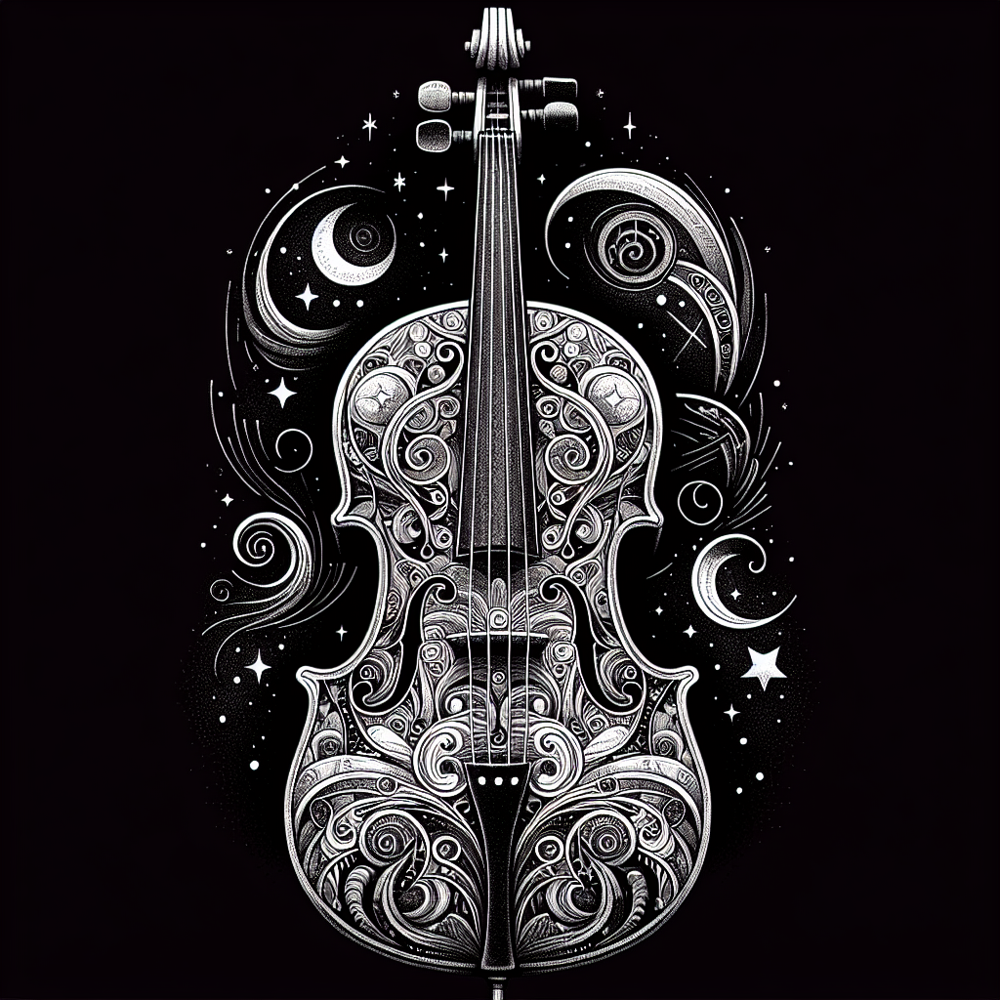

# Ensemble Generator Plugin

A [Signals & Sorcery](https://signalsandsorcery.com) plugin for jointly-composed multi-voice sections — describe one passage and get **2–6 voices composed together** as a **string ensemble**, a **funk horn section**, or a **chamber wind group**, each voice on its own track.

<p align="center">
  
</p>

> Part of the **[Signals & Sorcery](https://signalsandsorcery.com)** ecosystem.

## What it does

- One prompt ("solemn rising passage, modern baroque", "james brown horn stabs") composes ALL voices in a **single schema-forced LLM call** — the lines are planned together, not generated one-by-one and hoped into harmony
- **Instrumentation is the parent mode** — it picks the voice tables, the track roles, and the *rule family*; the style menu follows it:

  | Instrumentation | Rule family | Styles |
  |---|---|---|
  | **Strings** | woven — independent lines that converse | `counterpoint` · `chorale` · `interlock` |
  | **Horns** | section — every voice attacks WITH the lead | `stabs` · `riffs` · `unison` |
  | **Winds** | woven — same rules as strings, chamber-wind voices | `counterpoint` · `chorale` · `interlock` |

- **Configure first, generate once**: a freshly-added ensemble track is stamped as a group-of-one, so the instrumentation / style / voice-count menus exist BEFORE the first (expensive) generation — never config-by-regeneration
- The two rule families obey opposite physics. Woven modes demand imitation, contrary motion, staggered entrances, and *avoid* simultaneous attacks. The horn section inverts all of it: **one rhythm for the whole section**, harmonized under the lead, short accented punches with real space between them, syncopation and anticipated downbeats — biased hard toward dance and funk
- A **mechanical validator** (not the LLM) enforces the hard contract per voice — register octave-fold, root pinning, in-key snap with chord-tone exemptions, per-voice monophony, density caps, and (for `stabs`) a **duration ceiling** so a punch can't come back as a pad
- Soft rules are style-dependent and violations earn ONE guided retry: parallels are a defect in `counterpoint`, welcome in `interlock`, and the very mechanism of the horn styles — where the analyzer instead flags voices that **don't attack together enough**
- The voices land as **one voice-group**: the anchor row carries the prompt; the header holds the three intent controls; any row's Generate regenerates the whole ensemble; regeneration reconciles the group and **never replaces a sound you picked**
- **Sounds are placeholders by design**: voices load Surge XT with a category-appropriate patch (`strings` / `brass` / `winds` role + register drive the pick), but registers are **real instrument ranges in concert pitch** — swap in your sampled library (Kontakt, Omnisphere, …) and the MIDI already sits where actual sections play
- Sees the rest of the scene (drums, existing synths) through the shared concurrent-tracks context, so the ensemble interlocks with the mix instead of talking over it

## The voice tables

**Strings** (the original hierarchy — complexity decreases downward):

| Voice | Role | Register | Density | Discipline |
|---|---|---|---|---|
| top | lead | 72–96 | ≤8/bar | most florid; non-chord tones as passing/neighbor tones |
| … | strings | descending | descending | chord tones, smooth stepwise motion |
| bottom (5+) | 808s | 24–43 | ≤2/bar | **root pitch class only** |

**Horns** (a section speaks with one voice — equal caps, tight funk registers):

| Voices | Line-up |
|---|---|
| 2 | lead trumpet · tenor sax |
| 3 | lead trumpet · tenor sax · baritone sax (the J.B.'s trio) |
| 4 | + second trumpet |
| 5 | + trombone |
| 6 | + alto sax (big-band section) |

All horns carry role `brass`, share the lead's rhythm palette, and span lead trumpet C4–C6 down to bari sax C2–C4.

**Winds** (chamber winds, role `winds` — 5 voices = the classic quintet):

| Voices | Line-up |
|---|---|
| 2 | flute · bassoon |
| 3 | + clarinet |
| 4 | flute · oboe · french horn · bassoon |
| 5 | flute · oboe · clarinet · french horn · bassoon |
| 6 | + second flute |

Prompt hints work too: "french horns and flutes" routes to Winds (a french horn is a wind-family voice here), "brass stabs" routes to Horns with the `stabs` style, "3 horns" sets the count. Explicit menu choices always win.

## Install

From within Signals & Sorcery: **Settings > Manage Plugins > Add Plugin** and enter:

```
https://github.com/shiehn/sas-ensemble-plugin
```

Or clone manually into `~/.signals-and-sorcery/plugins/@signalsandsorcery/ensemble-generator/`.

## Capabilities

| Capability | Required |
|------------|----------|
| `requiresLLM` | Yes - joint multi-voice composition (schema-forced function calling) |
| `requiresSurgeXT` | Yes - per-voice placeholder synth preset loading |

## Dev

```bash
npm install
npm test        # jest — meta/reconcile, music helpers, ensemble-core behavior, instrumentation axis, the generation brain
npm run build   # tsup → dist (the app consumes dist via file: dep)
```

Requires `@signalsandsorcery/plugin-sdk` ≥ 2.39.0 (`ensemble-core`: voice-spec tables per instrumentation, hard per-voice enforcement incl. the stab ceiling, soft cross-voice analysis with the section togetherness rule, style packs, the `submit_ensemble` schema, the mode-branched joint prompt).
